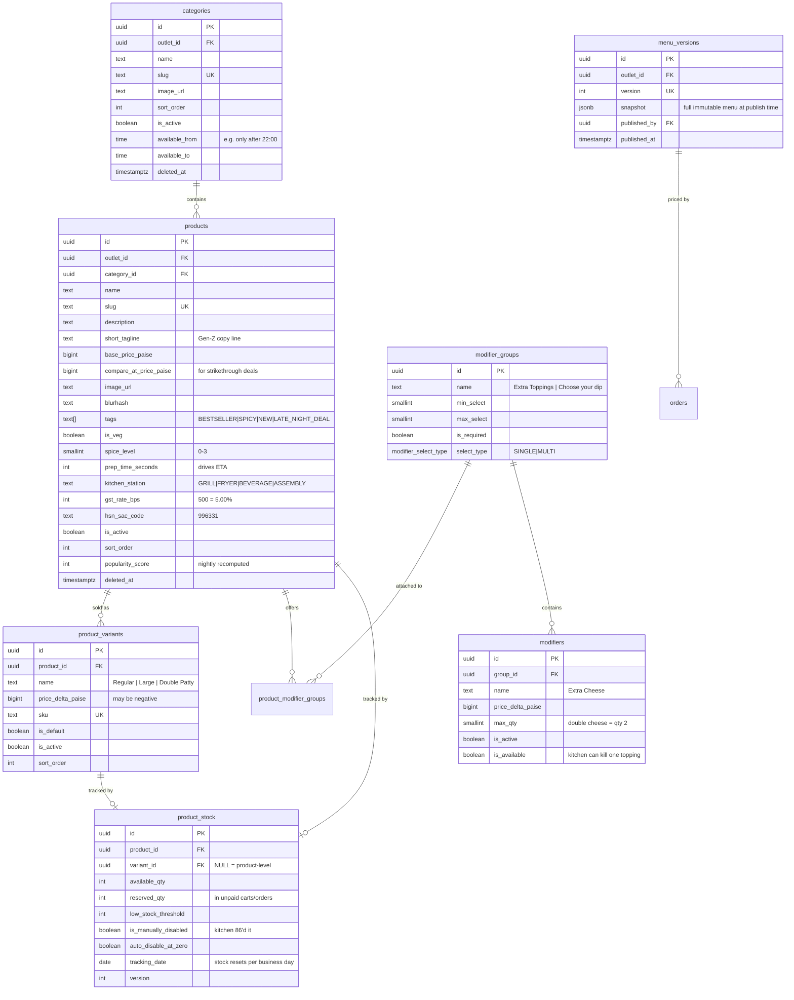
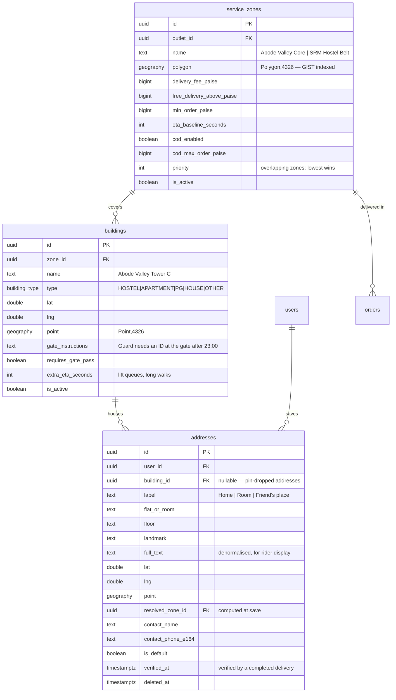
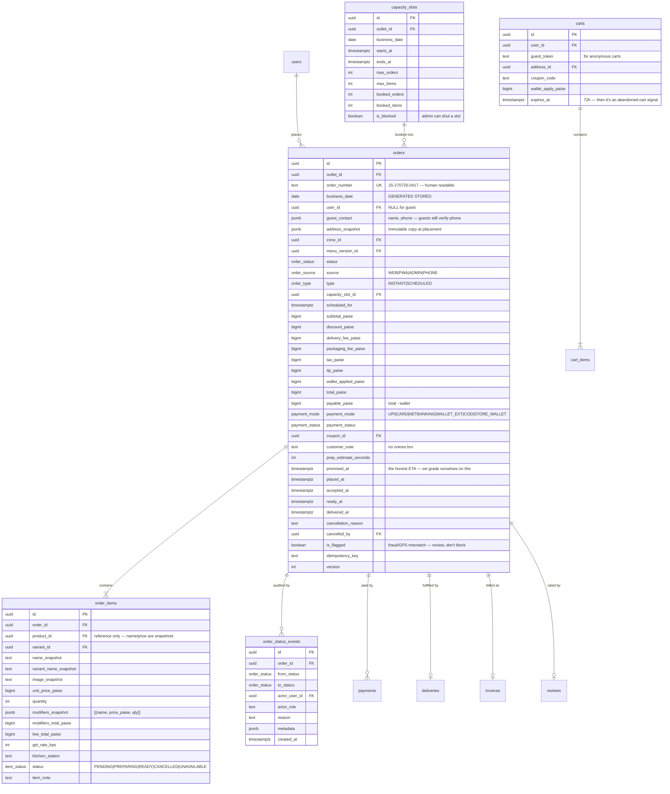

# 02 — Data Model & ERD

**PostgreSQL 16 + PostGIS 3.4** · Prisma ORM · UUIDv7 primary keys · all timestamps `timestamptz` (UTC)

---

## 1. Global conventions

| Rule | Detail | Why |
|---|---|---|
| **Primary keys** | `UUIDv7` (`id UUID PRIMARY KEY DEFAULT uuid_generate_v7()`) | Globally unique like UUIDv4, but **time-sortable** — keeps B-tree inserts sequential, avoiding the index bloat that killed UUIDv4 write performance |
| **Money** | `BIGINT` named `*_paise`. Never `FLOAT`, `REAL`, `MONEY`, or rupees | `0.1 + 0.2 != 0.3`. Every real payment bug I have seen starts with a float |
| **Timestamps** | `timestamptz`, stored UTC, rendered IST | Unambiguous; survives any future region |
| **Business day** | Generated stored column, see §3 | The service day crosses midnight |
| **Soft delete** | `deleted_at timestamptz NULL` on catalog, users, staff. **Never** on financial rows | Financial history is immutable by law and by sanity |
| **Auditing** | `created_at`, `updated_at`, `created_by`, `updated_by` on all mutable business tables | Every "who changed the price?" question, answered |
| **Optimistic locking** | `version INT NOT NULL DEFAULT 0` on `orders`, `product_stock`, `wallets`, `coupons` | Two admins, one order, no lost update |
| **Enums** | Native Postgres enums for closed sets; lookup tables where the business edits values | Type safety where it's fixed, flexibility where it isn't |
| **Naming** | `snake_case` tables (plural) & columns; Prisma maps to `camelCase` in TS via `@map` | Idiomatic on both sides |
| **Multi-tenancy** | `outlet_id UUID NOT NULL` on all operational tables from day one, one seeded outlet | Retrofitting a tenant key onto a live financial schema is a nightmare. Costs us nothing now |
| **JSONB** | Only for **snapshots** and **flexible config** — never for queryable relational data | Snapshots are immutable history; relations belong in columns |

**Extensions:** `uuid-ossp` / `pg_uuidv7`, `postgis`, `pg_trgm` (fuzzy search), `citext` (case-insensitive email), `pgcrypto`, `btree_gin`.

---

## 2. Bounded contexts

```
┌─────────────────┐  ┌─────────────────┐  ┌─────────────────┐  ┌─────────────────┐
│    IDENTITY     │  │    CATALOG      │  │      GEO        │  │   PLATFORM      │
│ users, sessions │  │ products, menu  │  │ zones, addresses│  │ settings, flags │
│ roles, perms    │  │ variants, mods  │  │ buildings       │  │ outbox, audit   │
└────────┬────────┘  └────────┬────────┘  └────────┬────────┘  └────────┬────────┘
         │                    │                    │                    │
         └────────────────────┴──────────┬─────────┴────────────────────┘
                                         │
                        ┌────────────────▼────────────────┐
                        │           ORDERING              │
                        │  carts · orders · order_items   │
                        │  status_events · capacity_slots │
                        └───┬──────────┬──────────┬───────┘
              ┌─────────────┘          │          └─────────────┐
   ┌──────────▼─────────┐  ┌───────────▼────────┐  ┌────────────▼───────┐
   │      KITCHEN       │  │      PAYMENTS      │  │     DELIVERY       │
   │ tickets · stations │  │ payments · refunds │  │ trips · deliveries │
   │ prep timers        │  │ webhooks · settle  │  │ riders · shifts    │
   └────────────────────┘  └─────────┬──────────┘  └────────────────────┘
                                     │
              ┌──────────────────────┼──────────────────────┐
   ┌──────────▼─────────┐  ┌─────────▼──────────┐  ┌────────▼───────────┐
   │      WALLET        │  │    PROMOTIONS      │  │     FINANCE        │
   │ ledger (append-only│  │ coupons · referrals│  │ invoices · expenses│
   └────────────────────┘  └────────────────────┘  │ cash drawers       │
                                                   └────────────────────┘
   ┌────────────────────┐  ┌────────────────────┐  ┌────────────────────┐
   │     REVIEWS        │  │   NOTIFICATIONS    │  │     ANALYTICS      │
   └────────────────────┘  └────────────────────┘  │  (rollups only)    │
                                                   └────────────────────┘
```

---

## 3. The business-day rule

```sql
-- migration: 0002_business_date.sql
ALTER TABLE orders ADD COLUMN business_date DATE
  GENERATED ALWAYS AS (
    ((created_at AT TIME ZONE 'Asia/Kolkata') - INTERVAL '5 hours')::date
  ) STORED;

CREATE INDEX idx_orders_business_date ON orders (outlet_id, business_date);
```

| Order placed (IST) | `created_at::date` (wrong) | `business_date` (right) |
|---|---|---|
| 27 Jul 19:05 | 27 Jul | **27 Jul** |
| 27 Jul 23:58 | 27 Jul | **27 Jul** |
| 28 Jul 01:30 | 28 Jul ❌ | **27 Jul** ✅ |
| 28 Jul 03:55 | 28 Jul ❌ | **27 Jul** ✅ |
| 28 Jul 19:10 | 28 Jul | **28 Jul** |

Applied identically to `payments`, `refunds`, `invoices`, `expenses`, `shifts`, `cash_drawer_sessions`,
and all `analytics_*` tables. Prisma reads it as `businessDate DateTime @db.Date` with no write access.

Without this, "yesterday's revenue" silently splits every night's takings across two rows, and the
finance panel is wrong from day one in a way nobody notices for months.

---

## 4. Domain ERDs

### 4.1 Identity & Access

```mermaid
erDiagram
    users ||--o{ user_identities : "authenticates via"
    users ||--o{ user_roles : has
    roles ||--o{ user_roles : "granted to"
    roles ||--o{ role_permissions : bundles
    permissions ||--o{ role_permissions : "in"
    users ||--o{ sessions : owns
    users ||--o| staff_profiles : "may be"
    users ||--o{ audit_logs : performs
    users ||--o{ push_subscriptions : registers

    users {
        uuid id PK
        text phone_e164 UK "nullable until verified"
        timestamptz phone_verified_at
        citext email UK
        timestamptz email_verified_at
        text password_hash "argon2id, staff+email users only"
        text full_name
        text avatar_url
        text referral_code UK "8-char, collision-checked"
        uuid referred_by_user_id FK
        user_status status "ACTIVE|SUSPENDED|BANNED|DELETED"
        smallint risk_score "0-100, fraud heuristics"
        int cod_strikes "failed/refused COD count"
        jsonb preferences "notif channels, dietary, theme"
        timestamptz last_login_at
        timestamptz deleted_at "DPDP erasure"
    }
    user_identities {
        uuid id PK
        uuid user_id FK
        auth_provider provider "PHONE|GOOGLE|EMAIL"
        text provider_uid "UNIQUE(provider, provider_uid)"
        jsonb raw_profile
    }
    roles {
        uuid id PK
        text key UK "SUPER_ADMIN|ADMIN|FINANCE|DISPATCHER|SUPPORT|KITCHEN_LEAD|KITCHEN_STAFF|RIDER|CUSTOMER"
        text name
        boolean is_system "cannot be deleted"
        int rank "for 'cannot escalate above self' checks"
    }
    permissions {
        uuid id PK
        text key UK "orders:refund, menu:publish, finance:export"
        text module
        text description
    }
    sessions {
        uuid id PK
        uuid user_id FK
        text refresh_token_hash UK "sha256, never the raw token"
        uuid family_id "rotation lineage — reuse revokes the family"
        uuid replaced_by_session_id FK
        text device_id
        text device_name
        text ip_address
        text user_agent
        timestamptz expires_at
        timestamptz revoked_at
        text revoked_reason
        timestamptz last_used_at
    }
    staff_profiles {
        uuid id PK
        uuid user_id FK UK
        uuid outlet_id FK
        text employee_code UK
        staff_type type "KITCHEN|RIDER|ADMIN|SUPPORT"
        text totp_secret_encrypted "pgcrypto; mandatory for ADMIN+"
        boolean totp_enabled
        date joined_at
        staff_status status "ACTIVE|ON_LEAVE|OFFBOARDED"
    }
    audit_logs {
        uuid id PK
        uuid actor_user_id FK
        text actor_role
        uuid impersonator_user_id FK "set when acting as another user"
        text action "order.refund, user.role_grant"
        text entity_type
        uuid entity_id
        jsonb before
        jsonb after
        text ip_address
        text user_agent
        uuid request_id
        timestamptz created_at
    }
```

Also in this context: `otp_requests` (phone, `code_hash`, purpose, `attempts`, `expires_at`,
`consumed_at`, ip — rate-limited and single-use), `password_reset_tokens`, `login_attempts`
(for lockout + IP intelligence).

> `audit_logs` is **append-only**, enforced by a `BEFORE UPDATE OR DELETE` trigger that raises.
> Monthly partitioned by `created_at`.

### 4.2 Catalog



Plus `stock_movements` (append-only: `product_id`, `delta`, `reason` — `RESTOCK|SALE|WASTE|CORRECTION|RELEASE`,
`ref_type`, `ref_id`, `actor_id`) so every unit is accounted for. `CHECK (available_qty >= 0)` and
`CHECK (reserved_qty >= 0)` are the last line of defence against oversell.

### 4.3 Geo & Addresses



`resolved_zone_id` is computed **once at save** (`ST_Contains`) and re-computed whenever zone polygons
change (a worker job). Serviceability at checkout is then a plain FK lookup, not a spatial query on
the hot path.

### 4.4 Ordering



`CHECK (total_paise = subtotal_paise - discount_paise + delivery_fee_paise + packaging_fee_paise + tax_paise + tip_paise)`
— the arithmetic invariant lives in the **database**, not just in the pricing service. If a bug ever
tries to write an inconsistent total, the transaction dies rather than the money.

### 4.5 Kitchen & Delivery

```mermaid
erDiagram
    orders ||--o| kitchen_tickets : "queued as"
    riders ||--o{ shifts : works
    riders ||--o{ trips : drives
    trips ||--o{ deliveries : batches
    orders ||--o| deliveries : "fulfilled by"
    shifts ||--o| cash_drawer_sessions : reconciles

    kitchen_tickets {
        uuid id PK
        uuid order_id FK UK
        uuid outlet_id FK
        int queue_position
        ticket_urgency urgency "NORMAL|WARNING|CRITICAL — derived from promised_at"
        uuid accepted_by FK
        timestamptz accepted_at
        timestamptz prep_started_at
        timestamptz ready_at
        int target_prep_seconds
        int actual_prep_seconds
        text rejection_reason
        boolean is_printed
        int print_attempts
    }
    riders {
        uuid id PK
        uuid user_id FK UK
        uuid outlet_id FK
        vehicle_type vehicle "BIKE|SCOOTER|CYCLE|FOOT"
        text vehicle_number
        text license_number_encrypted
        boolean is_online
        double current_lat
        double current_lng
        timestamptz last_ping_at
        int max_concurrent_deliveries
        numeric rating_avg
        int total_deliveries
    }
    shifts {
        uuid id PK
        uuid rider_id FK
        date business_date
        timestamptz started_at
        timestamptz ended_at
        int deliveries_completed
        int distance_meters
        bigint earnings_paise
        shift_status status
    }
    trips {
        uuid id PK
        uuid rider_id FK
        uuid shift_id FK
        trip_status status
        jsonb stop_sequence "optimised order of drops"
        timestamptz started_at
        timestamptz completed_at
        int distance_meters
    }
    deliveries {
        uuid id PK
        uuid order_id FK UK
        uuid trip_id FK
        uuid rider_id FK
        delivery_status status
        timestamptz assigned_at
        timestamptz accepted_at
        timestamptz picked_up_at
        timestamptz delivered_at
        text otp_hash "sha256 — plaintext never stored"
        smallint otp_attempts
        text proof_image_url
        text failure_reason
        int distance_meters
        double delivered_lat
        double delivered_lng
        bigint cod_collected_paise
    }
```

`rider_location_pings` (`rider_id`, `lat`, `lng`, `accuracy_m`, `recorded_at`) is **daily-partitioned**
with a 7-day retention policy. It is high-volume, low-value-after-the-fact data — partitioning makes
the drop a `DROP PARTITION` instead of a service-hours `DELETE` storm.

### 4.6 Payments, Wallet & Promotions

```mermaid
erDiagram
    orders ||--o{ payments : "settled by"
    payments ||--o{ refunds : "reversed by"
    payment_webhook_events }o--|| payments : "confirms"
    settlements ||--o{ settlement_items : itemises
    users ||--|| wallets : owns
    wallets ||--o{ wallet_ledger_entries : "append-only"
    coupons ||--o{ coupon_redemptions : "used as"
    users ||--o{ referrals : refers

    payments {
        uuid id PK
        uuid order_id FK
        date business_date
        payment_gateway gateway "RAZORPAY|STRIPE|CASH|STORE_WALLET"
        text gateway_order_id
        text gateway_payment_id UK
        payment_method method
        bigint amount_paise
        bigint gateway_fee_paise
        bigint gateway_tax_paise
        char currency "INR"
        payment_status status "CREATED|AUTHORIZED|CAPTURED|FAILED|REFUNDED|PARTIALLY_REFUNDED"
        timestamptz captured_at
        text failure_code
        text failure_reason
        jsonb gateway_response "redacted raw"
        text idempotency_key UK
    }
    payment_webhook_events {
        uuid id PK
        payment_gateway gateway
        text gateway_event_id UK "the idempotency anchor"
        text event_type
        jsonb payload
        boolean signature_valid
        webhook_status status "RECEIVED|PROCESSED|FAILED|IGNORED"
        int attempts
        text error
        timestamptz received_at
        timestamptz processed_at
    }
    refunds {
        uuid id PK
        uuid payment_id FK
        uuid order_id FK
        date business_date
        bigint amount_paise
        refund_reason reason "ITEM_UNAVAILABLE|KITCHEN_REJECT|LATE|QUALITY|DELIVERY_FAILED|GOODWILL|DUPLICATE"
        refund_destination destination "SOURCE|STORE_WALLET"
        refund_status status
        text gateway_refund_id
        uuid initiated_by FK
        uuid approved_by FK "4-eyes above threshold"
        timestamptz settled_at
    }
    wallets {
        uuid id PK
        uuid user_id FK UK
        bigint balance_paise "PROJECTION — reconciled nightly"
        wallet_status status "ACTIVE|FROZEN"
        int version
    }
    wallet_ledger_entries {
        uuid id PK
        uuid wallet_id FK
        ledger_direction direction "CREDIT|DEBIT"
        bigint amount_paise "always positive"
        bigint balance_after_paise
        ledger_reason reason "REFUND|REFERRAL|CASHBACK|ORDER_PAYMENT|ADMIN_ADJUST|EXPIRY"
        text ref_type
        uuid ref_id
        text idempotency_key UK
        uuid created_by FK
        timestamptz expires_at "promo credits expire"
        timestamptz created_at
    }
    coupons {
        uuid id PK
        text code UK "citext"
        coupon_type type "PERCENT|FLAT|FREE_DELIVERY|BXGY"
        int value_bps "percent"
        bigint value_paise "flat"
        bigint max_discount_paise
        bigint min_order_paise
        timestamptz starts_at
        timestamptz ends_at
        int total_usage_limit
        int total_used
        int per_user_limit
        boolean first_order_only
        uuid[] applicable_zone_ids
        uuid[] applicable_product_ids
        time valid_from_time "LATE NIGHT ONLY: 01:00-04:00"
        time valid_to_time
        boolean is_stackable
        boolean is_active
        int version
    }
    referrals {
        uuid id PK
        uuid referrer_user_id FK
        uuid referee_user_id FK UK "one referral per person, ever"
        text code
        referral_status status "PENDING|QUALIFIED|REWARDED|REJECTED_FRAUD"
        bigint referrer_reward_paise
        bigint referee_reward_paise
        uuid qualifying_order_id FK
        text device_fingerprint
        text signup_ip
    }
```

**The wallet is the highest-integrity object in the system.** `wallet_ledger_entries` is append-only
(trigger-enforced), every row carries `balance_after_paise`, and a nightly job asserts
`SUM(credits) - SUM(debits) == wallets.balance_paise` for every wallet. Any drift pages someone
immediately — a mismatch means a money bug, and money bugs compound silently.

`settlements` / `settlement_items` ingest Razorpay's daily settlement report for **three-way
reconciliation**: our `payments` ↔ gateway settlement ↔ bank credit.

### 4.7 Finance, Engagement & Platform

| Table | Key columns | Notes |
|---|---|---|
| `invoices` | `invoice_number` UK, `order_id`, `business_date`, `gstin`, `place_of_supply`, `taxable_paise`, `cgst_paise`, `sgst_paise`, `round_off_paise`, `total_paise`, `pdf_url`, `fssai_license_no`, `issued_at` | **Gapless sequential numbering per financial year** via a dedicated Postgres sequence + advisory lock. Cancelled orders get a credit note, never a deleted invoice |
| `expenses` | `business_date`, `category`, `vendor`, `amount_paise`, `payment_mode`, `receipt_url`, `note`, `created_by` | Drives true nightly profitability |
| `cash_drawer_sessions` | `shift_id`, `expected_paise`, `counted_paise`, `variance_paise`, `settled_by`, `settled_at`, `note` | COD reconciliation per rider per shift. Variance trends flag a leak long before it's material |
| `reviews` | `order_id` UK, `rating`, `food_rating`, `delivery_rating`, `comment`, `image_urls[]`, `is_published`, `moderated_by`, `reply_text` | One review per order. Moderation queue for abuse |
| `product_rating_aggregates` | `product_id`, `avg_rating`, `count`, `distribution jsonb` | Materialised; refreshed on review publish |
| `favorites` | `(user_id, product_id)` PK | |
| `notifications` | `user_id`, `channel`, `template_key`, `payload`, `status`, `provider_message_id`, `sent_at`, `read_at`, `error` | One row per attempted delivery — retries visible |
| `push_subscriptions` | `user_id`, `endpoint` UK, `p256dh`, `auth`, `device`, `last_seen_at` | Web Push (VAPID) |
| `banners` | `image_url`, `link`, `placement`, `starts_at`, `ends_at`, `priority`, `is_active` | |
| `cms_blocks` | `key` UK, `content jsonb`, `published_at` | FAQ, T&C, about |
| `settings` | `key` UK, `value jsonb`, `updated_by`, `updated_at` | Store config; **every write audited** |
| `store_hours` | `day_of_week`, `opens_at`, `closes_at` | Weekly template |
| `store_overrides` | `business_date` UK, `is_closed`, `opens_at`, `closes_at`, `reason` | Holidays, private events |
| `feature_flags` | `key` UK, `enabled`, `rollout_percent`, `payload jsonb`, `updated_by` | Super-admin controlled |
| `outbox_events` | `aggregate_type`, `aggregate_id`, `event_type`, `payload`, `created_at`, `published_at`, `attempts`, `last_error` | Partial index `WHERE published_at IS NULL` |
| `idempotency_keys` | `(key, user_id)` UK, `endpoint`, `request_hash`, `response_snapshot`, `status`, `expires_at` | 24 h TTL |
| `search_queries` | `query`, `user_id`, `result_count`, `clicked_product_id` | Zero-result queries are a **menu roadmap** |
| `analytics_daily` / `analytics_hourly` / `analytics_product_daily` | pre-aggregated rollups keyed on `business_date` | Computed at 05:30 post-close |

---

## 5. Seed data plan

| Set | Contents |
|---|---|
| Roles & permissions | 9 roles, ~70 permission keys, full mapping |
| Outlet | `Juice Stop — Kattankulathur` with GSTIN/FSSAI placeholders |
| Store hours | Mon–Sun 19:00 → 04:00 (+1) |
| Service zones | 2 polygons: `Abode Valley Core`, `SRM Hostel Belt` — traced from real coordinates during M1 |
| Buildings | Abode Valley towers, SRM hostel blocks, ~20 named PGs/apartments |
| Catalog | 8 categories, ~60 products, variants, 6 modifier groups, realistic prep times |
| Capacity | 10-minute slots, 19:00→04:00, tuned to real kitchen throughput |
| Users | 1 super admin, 1 admin, 1 finance, 2 kitchen, 3 riders, 25 synthetic customers |
| Orders | 400 historical orders across 14 business dates, realistic hourly curve (peak 22:30–00:30) — so the analytics dashboards are meaningful on day one instead of empty |

---

## 6. Migration policy

**Expand → migrate → contract.** Never destructive in a single deploy.

```
Deploy N   : ADD column (nullable / defaulted). Code writes BOTH old and new.
Deploy N+1 : Backfill job. Code reads NEW, still writes both.
Deploy N+2 : Code reads/writes NEW only.
Deploy N+3 : DROP old column.
```

Hard rules, CI-enforced by a migration linter:
- No `DROP COLUMN` / `DROP TABLE` in the same PR that stops using it.
- No blocking `ALTER TABLE ... ADD COLUMN NOT NULL DEFAULT` on tables > 100k rows.
- All index creation is `CREATE INDEX CONCURRENTLY` (outside a transaction).
- Every migration has a written rollback plan in its header comment.
- **Migrations run only in the deploy window (04:30–18:00 IST).** Never during service.

---

## 7. Indexing plan

Every index below exists because a specific query needs it. Anything not on this list gets added only
with an `EXPLAIN` in the PR description.

```sql
-- Hot path: the kitchen queue, hit every few seconds all night
CREATE INDEX idx_orders_kitchen_queue ON orders (outlet_id, status, placed_at)
  WHERE status IN ('PLACED','ACCEPTED','PREPARING','READY');

-- Customer order history
CREATE INDEX idx_orders_user_recent ON orders (user_id, placed_at DESC);

-- Finance & analytics
CREATE INDEX idx_orders_business_date ON orders (outlet_id, business_date, status);
CREATE INDEX idx_payments_business_date ON payments (business_date, status);

-- Live tracking
CREATE UNIQUE INDEX idx_orders_number ON orders (order_number);

-- Menu: fuzzy search
CREATE INDEX idx_products_search ON products USING gin (name gin_trgm_ops)
  WHERE deleted_at IS NULL AND is_active;

-- Spatial
CREATE INDEX idx_zones_polygon ON service_zones USING gist (polygon);
CREATE INDEX idx_buildings_point ON buildings USING gist (point);

-- Outbox relay: tiny index over a tiny working set
CREATE INDEX idx_outbox_unpublished ON outbox_events (created_at)
  WHERE published_at IS NULL;

-- Stock lookups during placement
CREATE UNIQUE INDEX idx_stock_product_variant ON product_stock (product_id, COALESCE(variant_id,'00000000-0000-0000-0000-000000000000'::uuid), tracking_date);

-- Sessions & auth
CREATE UNIQUE INDEX idx_sessions_token ON sessions (refresh_token_hash);
CREATE INDEX idx_sessions_family ON sessions (family_id) WHERE revoked_at IS NULL;

-- Dispatch
CREATE INDEX idx_deliveries_active ON deliveries (rider_id, status)
  WHERE status NOT IN ('DELIVERED','FAILED_NO_ANSWER','FAILED_WRONG_ADDRESS','FAILED_REFUSED');

-- Coupon abuse checks
CREATE UNIQUE INDEX idx_coupon_redemption_unique ON coupon_redemptions (coupon_id, order_id);
CREATE INDEX idx_coupon_user_count ON coupon_redemptions (coupon_id, user_id);

-- Audit
CREATE INDEX idx_audit_entity ON audit_logs (entity_type, entity_id, created_at DESC);
```

**Partitioned tables:** `audit_logs` (monthly), `rider_location_pings` (daily, 7-day retention),
`notifications` (monthly, 12-month retention), `analytics_hourly` (monthly).

---

## 8. Data retention & DPDP Act 2023 compliance

India's Digital Personal Data Protection Act applies here — we hold names, phones, addresses and
location for identifiable individuals.

| Data | Retention | On erasure request |
|---|---|---|
| Account (name, email, phone) | While active + 90 d | Anonymise: `phone → deleted+{hash}`, `email → NULL`, `name → 'Deleted User'` |
| Addresses | While active | Hard delete |
| Orders & order items | **8 years** (Income Tax Act §44AA + GST) | Retained, but `user_id` detached and `address_snapshot` redacted to building-level |
| Invoices | **8 years** | Retained in full — statutory, and this exemption is explicit in DPDP |
| Payments / refunds | 8 years | Retained, PII-stripped |
| Rider GPS pings | 7 days | Auto-dropped by partition |
| Audit logs | 3 years | Retained (legitimate-use exemption) |
| Session / device data | 30 d past expiry | Hard delete |
| Notification bodies | 12 months | Hard delete |

Implemented as: a `DELETE /me/account` request → 7-day grace (reversible, because students rage-quit
and come back) → anonymisation job → confirmation email. Not a hard `DELETE FROM users` — that would
cascade into financial records we are legally required to keep.

---

## 9. Backup & recovery

| Mechanism | Cadence | Retention | RPO | RTO |
|---|---|---|---|---|
| Managed automated backup + PITR (WAL) | continuous | 14 days | **< 5 min** | ~30 min |
| Logical `pg_dump --format=custom` → S3, SSE-KMS | daily 05:00 IST (post-close) | 30 daily / 12 monthly | 24 h | ~1 h |
| Cross-region S3 replication (ap-south-1 → ap-southeast-1) | continuous | 90 d | — | — |
| **Restore drill into a scratch environment** | **quarterly, scheduled, reported** | — | — | — |

A backup that has never been restored is not a backup. The drill is a calendar item with an owner.

The super-admin UI can *trigger* a backup and *view* status. Restore is a documented runbook executed
from a shell with two-person approval — a restore button in a web UI is how you lose a night's orders
to a misclick.
